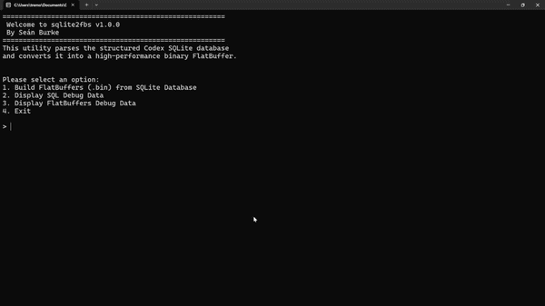
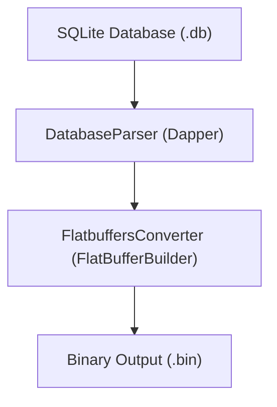
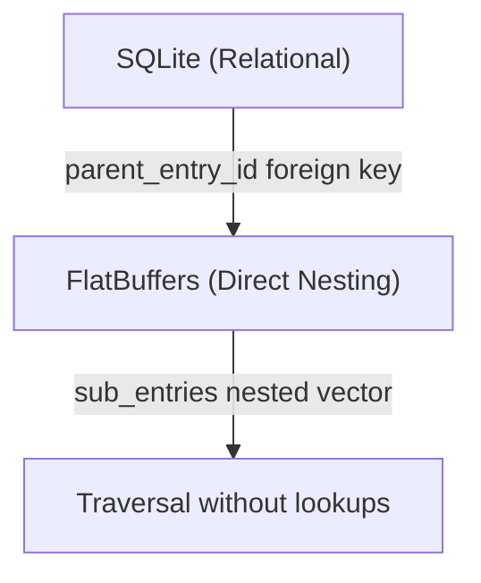

<div align="center">

# SQLite 2 Flatbuffers


SQLite to FlatBuffers conversion pipeline. Author game data in a database, ship it as zero-allocation binary.

<br/>



<br/>

</div>

#

A .NET console tool that bridges flexible data authoring and high-performance runtime access. Edit and structure game data in a SQLite database using any visual editor, then convert it to a FlatBuffers binary file that loads instantly with zero-allocation reads at runtime.

## Features

- **Three-layer pipeline** -- SQLite authoring, FlatBuffers runtime, conversion layer bridges them
- **Direct nesting** -- relational foreign keys are recursively resolved into nested FlatBuffer tables, eliminating runtime lookups
- **Dapper-based parsing** -- lightweight ORM maps database tables to strongly-typed C# records
- **Interactive validation** -- built-in debug menus to verify SQL input and FlatBuffer output side by side
- **Self-contained publish** -- single-file .NET 10 executable with no runtime dependencies

## Architecture

### Data Flow



- **SQLite Layer** -- Author data externally in a relational database. Edit tables visually, run queries, iterate fast.
- **FlatBuffers Layer** -- Convert relational data into a directly-nested binary schema. Zero-allocation reads, no deserialization overhead.
- **Conversion Layer** -- Reads SQLite via Dapper, builds the FlatBuffer tree recursively, writes the `.bin` file.

### Nesting Strategy



The key design decision: FlatBuffers uses **direct nesting** instead of foreign-key references. Where SQLite stores `parent_entry_id` as a relational link, the FlatBuffers schema nests sub-entries directly inside their parent. This eliminates runtime lookups and makes traversing the data tree a single sequential walk.

## FlatBuffers Schema

The schema mirrors the database structure with one intentional difference: direct nesting replaces foreign keys.

```flatbuffers
namespace CodexSystem;

enum ResourceType : byte { None = 0, Audio = 1, Image = 2 }
enum EntryType    : byte { Primary = 0, Secondary = 1 }

table Resource {
    id:            uint;
    file_path:     string;
    resource_type: ResourceType;
}

table Entry {
    id:             uint;
    requirement_id: uint;
    entry_type:     EntryType;
    title:          string;
    content:        string;
    audio_id:       uint;
    image_id:       uint;
    sort_order:     uint;
    sub_entries:    [Entry];
}

table Category {
    id:         uint;
    name:       string;
    sort_order: uint;
    entries:    [Entry];
}

table CodexRoot {
    categories: [Category];
    resources:  [Resource];
}

root_type CodexRoot;
```

## Usage

### Build & Run

```bash
dotnet build
dotnet run
```

The console app presents an interactive menu:

```
=======================================================
 Welcome to sqlite2fbs v1.0.0
 By Seán Burke
=======================================================

Please select an option:
1. Build FlatBuffers (.bin) from SQLite Database
2. Display SQL Debug Data
3. Display FlatBuffers Debug Data
4. Exit
```

- **Option 1** -- Parses the SQLite database and writes a `CodexData.bin` to the `output/` directory.
- **Option 2** -- Prints database stats (category/entry counts, resource breakdown).
- **Option 3** -- Validates the generated binary by reading it back through FlatBuffers and printing stats.

### Self-Contained Publish

```bash
dotnet publish -c Release
```

Produces a single-file, self-contained executable at `bin/Release/net10.0/win-x64/`.

## Example Data

The repo includes a bundled `CodexDatabase.db` containing **The Veil Compact**, an original sci-fi codex dataset inspired by the Mass Effect 2 codex structure:

- **10 categories** -- Aliens, Humanity, Government, Military, Technology, Worlds, History, Culture, Economy, The Hollow
- **Primary entries** -- audio narration + images
- **Secondary entries** -- text-only sub-entries
- **Unlock requirements** -- tied to game progression

<details>
<summary>Project Structure</summary>

```
├── Program.cs                  Entry point, interactive menu
├── console/
│   ├── AppData.cs              App constants, paths, config
│   ├── DatabaseParser.cs       Dapper-based SQLite reader
│   ├── DatabaseRecords.cs      Strongly-typed record types
│   ├── DatabaseValidator.cs    SQLite stats printer
│   ├── FlatbuffersConverter.cs Relational → FlatBuffer tree builder
│   └── FlatbuffersValidator.cs Binary validation & stats
├── flatbuffers/
│   ├── codex.fbs               FlatBuffers schema definition
│   └── CodexSystem/            Generated C# FlatBuffer classes
├── sqlite/
│   └── CodexDatabase.db        Bundled example database
└── sqlite2fbs.csproj           .NET 10 project file
```

</details>

## Tech Stack

- **.NET 10** (self-contained single-file publish)
- **Google FlatBuffers** 25.2.10 (zero-allocation binary serialization)
- **Microsoft.Data.Sqlite** + **SQLitePCLRaw** (database access)
- **Dapper** (lightweight ORM for strongly-typed queries)

## Future

This repo captures the core conversion pipeline, a stable, working backend for authoring SQLite data and shipping it as FlatBuffers binaries. The concept and conversion engine will serve as the foundation for a larger application that expands beyond the console interface, while this repository and its core architecture remain as-is.

---

> **License:** [MIT](LICENSE) Copyright (c) 2026 Seán Burke
